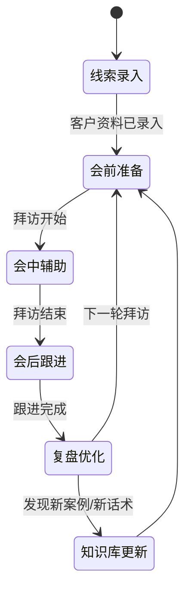

# Agent 工作流设计

## 1. 核心状态机

## 2. 会前准备工作流
- 接收客户资料
- 自动提取识别信号
- 调用类型判断工具
- 检索匹配案例
- 生成会前简报

## 3. 会中辅助工作流
- 接收实时输入
- 识别当前阶段
- 检索对应话术和案例
- 检测 objection
- 生成实时提示

## 4. 会后跟进工作流
- 接收会话记录
- 生成会议摘要
- 生成下一步动作
- 生成跟进话术
- 更新客户画像

## 5. 工具清单
- 客户分析工具
- 知识检索工具
- 话术生成工具
- CRM 写入工具
- 任务创建工具
