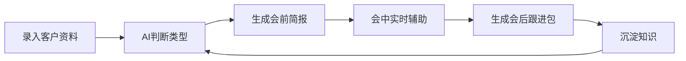

# 客户攻单AI — 详细 PRD

> **⚠️ 本文档已过时 — v0.1 立项稿，产品需求与实际实现严重脱节。**
> 当前项目状态见 [`README.md`](README.md)。

## 1. 产品概述
### 1.1 产品名称
- 中文：客户攻单AI
- 定位：销售 agent 式作战助手，不是聊天机器人

### 1.2 要解决什么问题
- 销售见客户前准备不足，容易“盲打”
- 客户类型判断依赖个人经验，新人上手慢
- 话术、案例、异议应答分散在资料里，现场拿不出来
- 会后没有标准化的沉淀和下一步动作
- 销售方法和案例难沉淀、难复用

### 1.3 产品目标
- 缩短会前准备时间
- 提高首面破冰成功率
- 提高方案通过率
- 缩短成交周期
- 把销售经验沉淀为可复用的 agent 能力

### 1.4 产品边界
- 默认不替代销售，只做“增强”
- 默认不做通用客服机器人
- 默认先服务“销售现场”主流程，再扩展管理后台

## 2. 目标用户与场景
### 2.1 核心用户
- 客户经理 / 销售代表
- 销售主管
- 业务运营 / 培训负责人

### 2.2 核心场景
- 见客户前：快速判断类型、生成战前卡片
- 会中：实时话术辅助、异议应答、案例引用
- 会后：跟进包、标签更新、知识沉淀
- 复盘：成功/失败案例结构化、经验回流到知识库

## 3. 产品原则
- 销售主导，AI 辅助
- 默认结构化输出，而非自由聊天
- 知识可追溯，建议可审计
- 先稳后智：先规则/检索，再LLM生成
- 先跑通最小闭环，再扩展

## 4. 功能范围
### 4.1 MVP 范围
- 客户资料录入与自动补全
- 客户类型判断
- 会前简报生成
- 会中辅助提示
- 会后跟进包
- 基础知识库检索
- 基础使用数据埋点

### 4.2 明确不做
- 不做全渠道自动外呼销售
- 不做自动签约/自动付款
- 不做完全脱离销售的人工智能成交系统
- 不做通用营销内容生成平台

## 5. 详细功能需求
### 5.1 客户资料管理
- 支持手动输入客户资料
- 支持导入公开信息（公司名、官网、行业、规模、阶段）
- 自动生成客户画像标签
- 支持备注、跟进记录、下次动作

### 5.2 客户类型判断
- 基于7类客户类型模型输出主类型、次类型、置信度
- 显示判断依据（识别信号、关键词）
- 支持销售手动修正类型标签
- 记录类型变化历史

### 5.3 会前简报
- 一句话客户判断结果
- 关键识别信号
- 核心切入句/破冰话术
- 推荐案例（1-3个）
- 潜在异议预判
- 建议下一步动作
- 支持导出/打印/分享

### 5.4 会中辅助
- 按五步法显示当前阶段：听、认、比、算、定
- 实时推荐当前阶段话术
- 实时推荐案例引用
- 异议实时应答建议
- 支持手动记录关键信息
- 支持语音转写（可选）

### 5.5 会后跟进
- 自动生成会议摘要
- 生成客户类型确认/更新建议
- 生成下一步动作清单
- 生成跟进话术（邮件/微信/SOP）
- 自动创建跟进任务
- 支持知识沉淀入口

### 5.6 知识库管理
- 客户类型知识维护
- 案例库维护
- 话术库维护
- 数据证言库维护
- 支持导入/导出
- 支持版本记录

### 5.7 销售辅导与管理
- 客户类型分布看板
- 案例使用率
- 方案通过率
- 转化周期追踪
- 销售满意度调研

## 6. 用户旅程与核心流程
### 6.1 主流程

### 6.2 关键页面
- 客户列表页
- 客户详情页
- 会前简报页
- 会中辅助页
- 会后跟进页
- 知识库管理页
- 数据看板页

## 7. 信息架构
### 7.1 客户实体
- 基础信息：名称、行业、规模、阶段、地区
- 类型信息：主类型、次类型、置信度、判断依据
- 跟进信息：下次动作、关键决策人、待决策问题
- 效果信息：方案状态、转化阶段、历史结果

### 7.2 知识库实体
- 客户类型：识别信号、关键词、切入句、禁忌、推荐案例
- 案例：行业、阶段、规模、困境、动作、结果、指标、金句
- 话术：场景、类型、模板、使用条件
- 数据证言：来源、核心数据、适用场景、引用话术

## 8. 交互与体验要求
### 8.1 界面原则
- 移动端优先，支持会中单手操作
- 信息密度高，但不杂乱
- 一键复制话术、一键导出简报
- 减少输入，多用选择和推荐

### 8.2 核心交互
- 客户资料输入支持智能补全
- 类型判断结果可一键确认或修正
- 会中辅助支持语音输入和快捷标签
- 知识引用必须带来源说明

## 9. 非功能需求
### 9.1 性能
- 会前简报生成：< 10秒
- 会中话术推荐：< 3秒
- 知识库检索：< 2秒
- 页面加载：< 2秒

### 9.2 安全
- 客户资料脱敏
- 对外话术审计
- 分权限访问
- 操作留痕

### 9.3 可用性
- 支持断网使用基础功能
- 支持多端同步
- 支持导出常见格式

## 10. 成功指标
### 10.1 效率指标
- 会前准备时间缩短比例
- 会中找资料时间缩短比例

### 10.2 质量指标
- 首面破冰成功率
- 方案通过率
- 客户类型判断准确率
- 建议采纳率

### 10.3 业务指标
- 成交周期缩短比例
- 客单价变化
- 销售新人上手周期

### 10.4 使用指标
- DAU/MAU
- 人均使用时长
- 功能使用分布
- 知识库更新频率

## 11. 风险与约束
### 11.1 业务风险
- 销售习惯改变成本高
- 知识库维护成本高
- 客户资料质量差导致判断不准

### 11.2 技术风险
- LLM 幻觉问题
- 会话识别准确率
- 多端同步复杂度

### 11.3 约束
- 优先保证销售现场可用性
- 优先保证知识可追溯
- 优先保证数据安全

## 12. 发布计划
### 12.1 MVP（第1-4周）
- 客户资料录入
- 客户类型判断
- 会前简报
- 基础话术检索
- 基础使用埋点

### 12.2 V1.0（第5-8周）
- 会中辅助
- 会后跟进包
- 知识库管理
- 数据看板

### 12.3 V1.5（第9-12周）
- LLM增强生成
- 自动摘要
- 智能补全
- 多端同步

### 12.4 V2.0（第13-24周）
- CRM集成
- 语音转写
- 高级分析
- 组织级知识沉淀

## 13. 依赖与资源
### 13.1 数据依赖
- 客户资料输入
- 销售培训资料
- 案例沉淀资料

### 13.2 系统依赖
- CRM系统（可选）
- 企业微信/飞书（可选）
- LLM API
- 向量数据库（V1.5+）

### 13.3 人力依赖
- 产品负责人
- 销售负责人
- 研发团队
- 销售培训师

## 14. 附录
### 14.1 术语表
- 客户攻单：针对特定客户推进成交的过程
- 五步法：听、认、比、算、定
- 类型判断：基于客户信号判断其属于7类客户中的哪一类
- 会前简报：拜访前生成的作战卡片
- 会中辅助：拜访过程中的实时提示

### 14.2 参考文档
- `/Users/jarod/Dev/sales/docs/客户攻单AI-计划方案.md`
- `/Users/jarod/Dev/sales/docs/客户攻单AI-agent实现方案.md`
- `/Users/jarod/Dev/sales/docs/客户攻单AI-agent技术架构.md`
