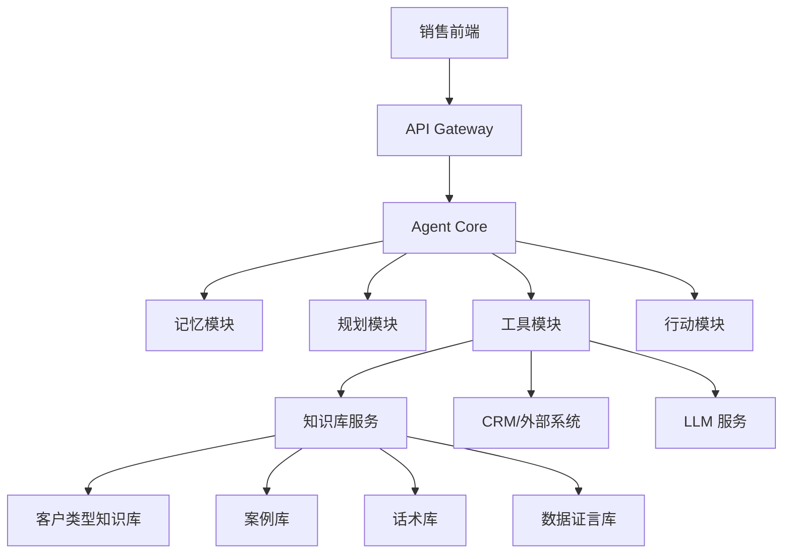
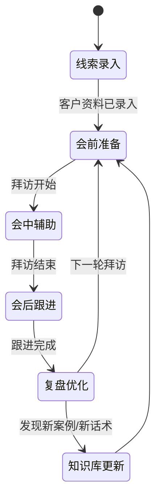

# 客户攻单AI：Agent 技术架构详图

> **⚠️ 本文档已过时 — 反映立项初期的设计思路，与实际代码实现存在重大偏差。**
> 当前项目状态见 [`README.md`](README.md)。

## 1. 总体架构


## 2. Agent 状态机


## 3. 核心接口设计
### 3.1 会前准备接口
```json
{
  "input": {
    "customer": {
      "name": "公司名",
      "industry": "行业",
      "revenue": "营收规模",
      "stage": "发展阶段",
      "source": "线索来源"
    }
  },
  "output": {
    "customer_type": "竞争突围型",
    "confidence": 0.85,
    "strategy": "饱和攻击 + 差异化",
    "opening_line": "这个赛道竞争看着激烈，但我发现你们有别人没有的差异化优势...",
    "recommended_cases": ["Ulike脱毛仪"],
    "potential_objections": ["太贵了", "我们再看看"],
    "next_step": "建议先做3城1个月测试方案"
  }
}
```

### 3.2 会中辅助接口
```json
{
  "input": {
    "session_id": "会话ID",
    "transcript": "实时转写/手动输入",
    "current_stage": "认/比/算/定"
  },
  "output": {
    "stage_guidance": "现在进入'比'阶段，建议引入同体量案例...",
    "suggested_response": "XX当年跟您情况一致...",
    "objection_detected": "客户提到预算问题",
    "objection_response": "我可以把单次触达成本拆解给您看..."
  }
}
```

### 3.3 会后跟进接口
```json
{
  "input": {
    "session_id": "会话ID",
    "summary": "会议摘要",
    "decisions": ["同意做测试方案"],
    "pending_actions": ["对接市场部负责人"]
  },
  "output": {
    "follow_up_email": "...",
    "follow_up_wechat": "...",
    "tasks": [
      {
        "type": "发送测试方案",
        "deadline": "3个工作日内",
        "owner": "销售"
      }
    ],
    "knowledge_update": {
      "new_phrase": "客户提到...",
      "new_objection": "..."
    }
  }
}
```

## 4. 技术栈选择
### 4.1 MVP 阶段
- 后端：Python FastAPI
- Agent 框架：LangGraph 或自研状态机
- LLM：OpenAI API / 国产大模型 API
- 知识库：PostgreSQL + 简单全文检索
- 前端：Streamlit / Chainlit
- 数据格式：JSON + CSV

### 4.2 生产阶段
- 后端：FastAPI + 任务队列（Celery/Arq）
- Agent 框架：LangGraph / CrewAI / 自研
- LLM：GPT-4o / Claude 3.5 Sonnet
- 知识库：PostgreSQL + 向量数据库（Milvus/Pinecone）
- 前端：React + 企微/飞书小程序
- 监控：LangSmith / 自研日志系统

## 5. 开发里程碑
### Week 1-2：知识库结构化
- 把7类客户类型、五步法、案例库、话术库转成结构化数据
- 设计数据库 Schema
- 建立基础检索能力

### Week 3-4：Agent 核心
- 实现客户类型判断规则引擎
- 实现会前简报生成
- 实现基础话术检索

### Week 5-6：LLM 增强
- 接入 LLM 做自然语言理解
- 实现会中实时辅助
- 实现会后跟进话术生成

### Week 7-8：集成与优化
- 对接 CRM（或 Excel/飞书表格）
- 加入会话记忆
- 加入使用数据埋点

## 6. 关键设计决策
### 6.1 为什么先用规则 + 检索，再上 LLM？
- 销售场景对准确性要求高，不能全靠生成式 AI 自由发挥
- 规则 + 检索提供确定性基线，LLM 提供灵活性
- 更容易调试和解释“为什么给出这个建议”

### 6.2 为什么采用状态机管理会话阶段？
- 销售拜访有明确的阶段性（听→认→比→算→定）
- 状态机确保不会跳步、不会遗漏关键环节
- 便于追踪转化率和阶段卡点

### 6.3 知识库为什么分多层？
- 客户类型知识：结构化程度高，适合规则匹配
- 案例库：半结构化，适合向量检索
- 话术库：模板化，适合模板填充
- 数据证言：高可信度要求，必须引用原始来源
