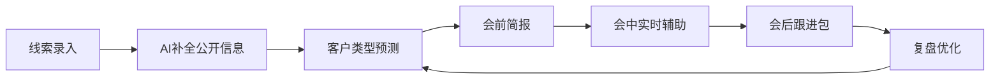

# 客户攻单AI：基于两份销售内训资料的深度分析与产品计划

> **⚠️ 本文档已过时 — 立项初期的分析文档，产品设计已发生重大变化。**
> 当前项目状态见 [`README.md`](README.md)。

## 1. 阅读范围与目标
- 已深度阅读：
  - `/Users/jarod/Desktop/分众客户七大类型 · 识别与攻单策略.pptx`
  - `/Users/jarod/Desktop/分众销售作战速查卡片.pptx`
- 本次任务目标：
  - 把两份PPT里的销售知识，梳理成可直接用于“客户攻单AI”的产品知识体系；
  - 提出可落地的AI功能框架、数据层、用户旅程、MVP范围和下一步建议。

## 2. 核心发现：两份PPT其实已经是“半成品知识库”
### 2.1 第一份PPT：体系完整，适合做产品骨架
- 核心主线：先对号入座，再选武器上膛。
- 可直接复用的结构：
  - 7种客户类型：品牌野心型、定位卡位型、品类开创者型、竞争突围型、资本叙事型、全国化扩张型、品牌焕新型。
  - 每种类型都有：识别信号、核心痛点、攻单策略、核心话术、典型案例。
  - 攻单五步法：听、认、比、算、定。
  - 一句话破冰、拒绝应答、工具卡。
  - 权威数据证言：凯度“一抖一书一分众”、电梯广告到达率等。
  - 价值论证逻辑：品牌资产、心智货架、饱和攻击、认知重构等。

### 2.2 第二份PPT：口袋版，适合做一线销售助手
- 7种客户类型压缩成速查卡，适合做成AI的“客户类型判断入口”。
- 五步法压缩成交骨架，适合做成AI会中辅助和会后闭环。
- 五大禁忌适合做成AI话术质量检查、风险拦截。

## 3. 7类客户画像（可直接结构化）
| 类型 | 识别词/信号 | 核心诉求 | 攻单核心 | 禁忌 | 典型案例 |
| --- | --- | --- | --- | --- | --- |
| 品牌野心型 | 长期主义、行业标杆、竞品压力 | 建立品牌资产与长期壁垒 | 品牌资产投资 | 只谈CPM、短期流量 | 飞鹤、波司登 |
| 定位卡位型 | 某个关键词/场景必须是我的 | 抢占心智、防止被竞品替代 | 心智货架、15秒超级话语 | 只求规模声量 | 妙可蓝多 |
| 品类开创者型 | 新品类、规则由我来定 | 快速教育市场、定义品类 | 品类教育速度 | 急功近利谈即时转化 | 元气森林 |
| 竞争突围型 | 翻盘、改变格局 | 同质化红海中破局 | 饱和攻击、差异化 | 空谈长期主义 | Ulike |
| 资本叙事型 | 估值、融资、Pre-IPO、对赌 | 用品牌势能撑估值 | 估值杠杆、品牌资产化 | 纠缠琐碎ROI | 新消费融资品牌 |
| 全国化扩张型 | 出省、全国布局、核心城市 | 先建立全国认知再铺渠道 | 认知先行、核心城市打样 | 只谈区域经验 | 老乡鸡、茶颜悦色 |
| 品牌焕新型 | 变年轻、破圈、找回市场活力 | 打破老化认知、吸引新人群 | 认知重构、新故事讲给新人 | 沉湎历史、固步自封 | 波司登 |

## 4. 攻单AI：产品定位
- 不是替代销售，而是把“销售内训材料”变成“可调用、可推荐、可复用”的AI作战助手。
- 一句话价值：
  - 输入客户资料、会话记录、公开信号；
  - 输出客户类型判断、攻单策略、话术包、异议应答、测试方案、下一步动作。

## 5. 功能架构
### 5.1 知识底座层
- 客户类型知识图谱
- 案例知识库
- 数据证言库
- 会话模板库
- 行业/阶段/规模分类标签

### 5.2 推理编排层
- 客户类型分类器
- 场景策略推荐
- 异议应答路由
- 话术生成
- ROI/测试方案测算

### 5.3 销售现场层
- 会前客户简报
- 会中实时辅助
- 会后跟进包
- 测试方案
- 复盘与优化提示

## 6. 用户旅程

## 7. 数据层设计
### 7.1 客户类型知识
- 类型、识别信号、关键词、目标、风险、切入句、禁忌、推荐案例

### 7.2 案例知识
- 行业、阶段、规模、困境、动作、结果、可量化指标、来源、金句

### 7.3 数据证言
- 媒介组合、触达数据、搜索变化、营收变化、品牌资产话术

### 7.4 会话模板
- 开场白、追问清单、五步法话术、异议应答、跟进SOP

## 8. MVP建议
- 先不要上复杂RAG
- 先做成“销售助手MVP”：
  - 会前简报
  - 客户类型判断
  - 一句话破冰
  - 常见异议应答
- 验证后，再补：
  - 案例匹配
  - 测试方案生成
  - 会后跟进包
  - 运营看板

## 9. 非功能要求
- 客户资料脱敏
- 对外话术审计
- 行业禁忌检查
- 权限分层
- 使用日志

## 10. 下一步
1. 把7种客户类型和五步法做成第一版可检索知识表。
2. 设计一个销售测试场景，跑通“资料输入 → 类型判断 → 话术输出”。
3. 选择1个销售角色、1个客户类型做最小闭环验证。
